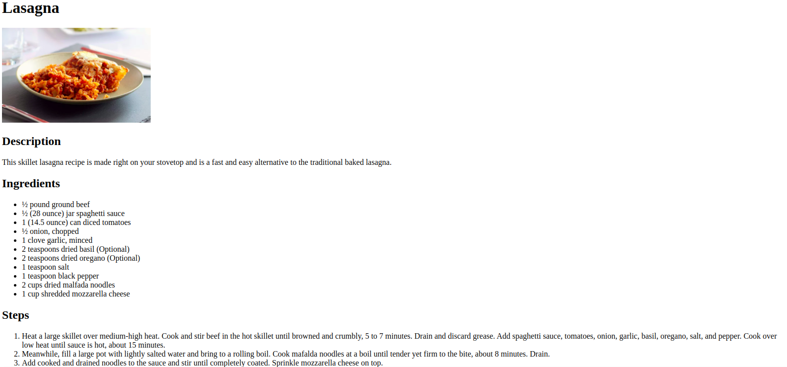

# Odin Recipes

## Introduction

Odin Recipes is a basic recipe website, which is the first project in the odin project's foundations course that I am taking.

## Screenshots



## Features

- A main index page with links to multiple recipe pages.
- Individual recipe pages featuring:
  - An image of the dish.
  - A description of the recipe.
  - A list of ingredients.
  - Step-by-step instructions.
- Easy navigation between the homepage and each recipe page.

## Technologies Used

- HTML

## Setup

1. **Clone the Repository**: Clone this repository to your local machine by typing this into your terminal (note: you need to have git installed):

   ```bash
   git clone git@github.com:aam4hmoud/odin-recipes.git
   ```

2. **Open the `index.html` file** using your favorite web browser (e.g. Chrome) by double-clicking the file or right-clicking and choosing `Open with` > `Chrome`.

## File Structure

```
  odin-recipes/
├── index.html
├── LICENSE
├── README.md
├── images/
│   ├── biriyani.png
│   ├── lasagna.png
│   ├── screenshot.png
│   └── spicy-chicken-curry.png
└── recipes/
    ├── biriyani.html
    ├── lasagna.html
    └── spicy-chicken-curry.html
```

## Live Demo

You can view the live version of this project here: [Live Demo](https://aam4hmoud.github.io/odin-recipes/)

## Future Improvements

In future iterations, CSS will be added to style the website and improve the user interface.

## Learning Goals

By completing this project, I have demonstrated:

- Structuring a basic HTML website.
- Creating links between pages.
- Organizing content using HTML headings, lists, and images.

## Credits

- The images and recipes used in this project were sourced from [Allrecipes](https://www.allrecipes.com/).
- Thanks to [The Odin Project](https://www.theodinproject.com/) for providing the curriculum and guidance for this project.

## License

This project is licensed under the [MIT License](LICENSE).
